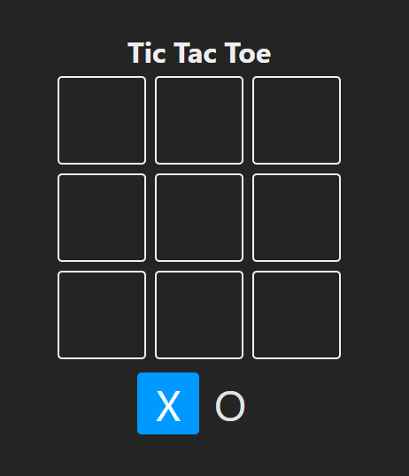

# 🎮 Tic Tac Toe - React Edition

A simple yet fun **Tic Tac Toe** game built with **React**. It features dynamic turns, automatic winner detection, and a festive 🎉 confetti animation when someone wins.



---

## 🚀 Tech Stack

- ⚛️ **React** with hooks (`useState`, `useEffect`)
- 💅 **CSS** for styling and visual effects
- 🎊 **canvas-confetti** for the winner celebration

---

## 🎮 How to Play

- Two players take turns clicking on an empty square.
- The first to align three of their marks (horizontally, vertically, or diagonally) wins.
- When a player wins, a confetti animation is triggered.
- You can reset the game using the **Reset** button.

---

## 📦 Installation

1. Clone the repository:

```bash
git clone https://github.com/your-username/tic-tac-toe-react.git
cd tic-tac-toe-react
npm install
```

2. Run in development mode
```bash 
npm run dev
```
